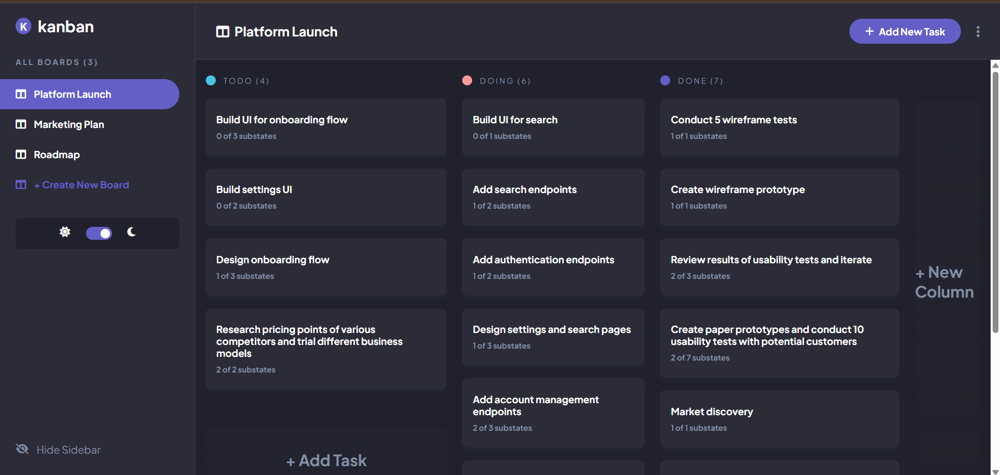

# Kanban Task Management App

 

A fully functional Kanban-style task management application with light/dark mode toggle. This app allows you to create, edit, and delete boards, columns, and tasks with a drag-and-drop interface.

## Features

- 📋 **Task Management**
  - Create, edit, and delete tasks
  - Add subtasks to tasks
  - Track task completion status
  - Drag and drop tasks between columns

- 🗄️ **Board Management**
  - Create multiple boards
  - Edit board names and structure
  - Delete boards when no longer needed

- 📊 **Column Management**
  - Add custom columns to boards
  - Edit column names and colors
  - Remove columns (with all contained tasks)

- 🌓 **Theme Options**
  - Light and dark mode
  - Persistent theme preference
  - System preference detection

- 📱 **Responsive Design**
  - Works on desktop and mobile devices
  - Collapsible sidebar for smaller screens

## Technologies Used

- **Frontend**
  - HTML5
  - CSS3 (with CSS Variables for theming)
  - JavaScript (ES6+)
  - Font Awesome for icons
  - Google Fonts (Plus Jakarta Sans)

## Installation

No installation required! This is a pure frontend application that runs in the browser.

1. Clone this repository:
   ```bash
   git clone https://github.com/your-username/kanban-board.git
